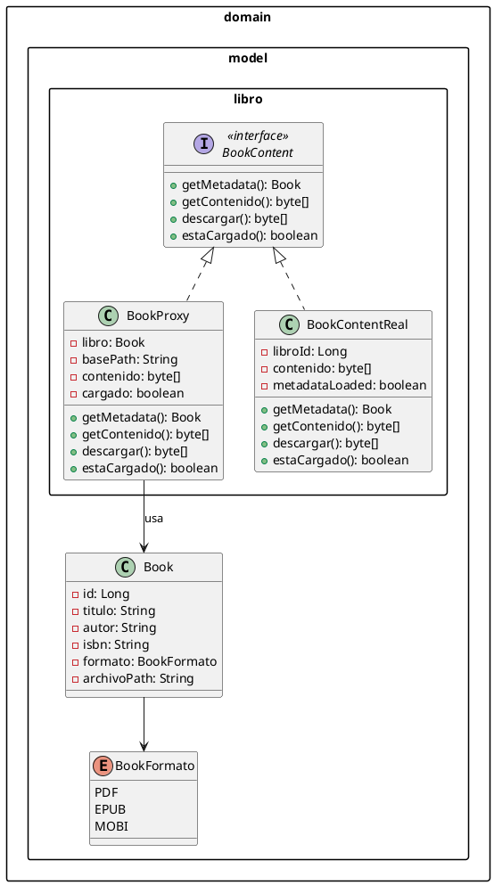

# Patrón Proxy - Carga Diferida de Contenido de Libros

## 1. Problema

### Situación actual en la Biblioteca

Cuando un usuario lista los libros en la biblioteca, actualmente se cargan todos los datos de los libros, incluyendo los archivos de contenido (PDF, EPUB, MOBI).

```
Escenario actual:
┌─────────────────────────────────────────────────────────────┐
│  Usuario accede a "Listar Libros"                          │
│  (catálogo con 50+ libros)                                │
└──────────────────────┬────────────────────────────────────┘
                       │
                       ▼
┌─────────────────────────────────────────────────────────────┐
│  Sistema carga TODA la información de cada libro:            │
│  - Metadata (título, autor, isbn) ✓                       │
│  - Contenido archivo (PDF ~10MB) ✗                        │
└──────────────────────┬────────────────────────────────────┘
                       │
                       ▼
┌─────────────────────────────────────────────────────────────┐
│  Resultado: 50 libros × 10MB = 500MB                     │
│  - Lentitud al cargar lista                             │
│  - Ancho de banda desperdiciado                            │
│  - Memoria saturada                                    │
└─────────────────────────────────────────────────────────────┘
```

### Problemas identificados:

- ❌ **Rendimiento**: Cargar archivos grandes innecesariamente
- ❌ **Ancho de banda**: Transmission de datos que no se necesitan
- ❌ **Memoria**: Consumo excesivo de RAM
- ❌ **UX**: Percepción de lentitud por parte del usuario
- ❌ **Ineficiencia**: El usuario solo ve 10-20 libros en pantalla pero carga todos los archivos

---

## 2. Justificación del Patrón Virtual Proxy

### ¿Qué es el Virtual Proxy?

El Virtual Proxy es una variación del patrón **Proxy** que pospone la creación de objetos costosos hasta que realmente se necesitan.

```
Concepto:
┌──────────────────┐      ┌──────────────────┐
│   Cliente        │ ───► │    Proxy        │ ───► Objeto Real
│ (Frontend)       │      │ (Virtual)       │   (Contenido)
└──────────────────┘      └──────────────────┘
                                │
                                │ Carga solo metadata (rápido)
                                ▼
                                ┌─────────────────────┐
                                │ Primera solicitud  │
                                │ → carga contenido │
                                │ real              │
                                └─────────────────────��
```

### ¿Por qué Virtual Proxy es la solución ideal?

1. **Lazy Loading**: El contenido pesado se carga solo cuando el usuario lo solicita
2. **Transparencia**: El cliente no sabe que existe un proxy
3. **Rendimiento**: Los listados son inmediatos
4. **Sin modificar la arquitectura existente**: Se integra con FileUploader

### Aplicabilidad en este proyecto

| Cuando usar Virtual Proxy | Caso de uso en Biblioteca |
|---------------------------|---------------------------|
| Creación costosa de objetos | Carga de archivos/pdf/epub (mbytes) |
| No siempre necesarios | Contenido solo al descargar |
| Múltiples instancias | Todos los libros del catálogo |
| Optimización de memoria | No cargar todo en memoria |

---

## 3. Solución Propuesta

### Arquitectura del Virtual Proxy

```
┌─────────────────────────────────────────────────────────────────┐
│                    BookController                               │
│         (Recibe HTTP → retorna libros)                         │
└────────────────────────────┬────────────────────────────────────┘
                             │
                             ▼
┌─────────────────────────────────────────────────────────────────┐
│                    BookProxy (Virtual Proxy)                  │
├─────────────────────────────────────────────────────────────────┤
│ - metadata: BookMetadata (título, autor, isbn) → carga        │
│   INMEDIATO                                                   │
│ - contenido: byte[] → carga SOLO cuando se descarga            │
│ - libroId: Long                                                │
├─────────────────────────────────────────────────────────────────┤
│ - getMetadata(): BookMetadata → retorna inmediatamente         │
│ - getContenido(): byte[] → carga lazy cuando se llama         │
│ - descargar(): byte[] → fuerza carga completa                │
│ - estaCargado(): boolean                                       │
└────────────────────────────┬────────────────────────────────────┘
                             │
                 ┌───────────┴───────────┐
                 ▼                       ▼
┌──────────────────────────┐  ┌─────────────────────────────────┐
│  Metadata                 │  │   ContenidoReal                 │
│ (ligero, siempre         │  │ (pesado, solo cuando            │
│  disponible)             │  │  se necesita)                  │
└──────────────────────────┘  └─────────────────────────────────┘
```

### Estructura de archivos

**Clases EXISTENTES (reutilizar):**

```
src/main/java/com/biblioteca/digital/
├── domain/
│   └── model/
│       └── Book.java                 ← YA EXISTE (metadata: titulo, autor, isbn, formato, archivoPath)
│   └── BookFormato.java              ← YA EXISTE
└── application/
    └── service/
        └── BookService.java          ← YA EXISTE (lógica de negocio)
```

**Clases NUEVAS a crear:**

```
src/main/java/com/biblioteca/digital/
├── domain/
│   └── model/
│       └── libro/
│           ├── BookContent.java      (NUEVA - interfaz)
│           └── BookProxy.java        (NUEVA - Virtual Proxy)
```

### Clases existentes vs nuevas

| Clase | Tipo | Descripción |
|-------|------|-------------|
| `Book.java` | **REUTILIZAR** | Ya tiene: id, titulo, autor, isbn, formato, archivoPath |
| `BookFormato.java` | **REUTILIZAR** | Enum de formatos (PDF, EPUB, MOBI) |
| `BookService.java` | **REUTILIZAR** | Lógica de negocio existente |
| `BookContent.java` | **NUEVA** | Interfaz para el contenido |
| `BookProxy.java` | **NUEVA** | Virtual Proxy con lazy loading |

### Diagrama de clases (PlantUML)



---

## 4. Implementación

### Interfaz Subject

```java
// domain/model/libro/BookContent.java
package com.biblioteca.digital.domain.model.libro;

public interface BookContent {
    BookMetadata getMetadata();
    byte[] getContenido();
    boolean estaCargado();
    byte[] descargar();
}
```

### Metadata (objeto ligero)

```java
// domain/model/libro/BookMetadata.java (OPCIONAL - se puede obtener de Book existente)
// package com.biblioteca.digital.domain.model.libro;
//
// import java.time.LocalDateTime;
//
// public class BookMetadata {
//     private Long id;
//     private String titulo;
//     private String autor;
//     private String isbn;
//     private BookFormato formato;
//     private long tamanoBytes;
//     private LocalDateTime fechaRegistro;
//
//     // Constructor, getters, setters
//
//     // Alternativa: Usar la clase Book existente directamente
// }
// ```

### Real Subject (objeto costoso)

```java
// domain/model/libro/BookContentReal.java
package com.biblioteca.digital.domain.model.libro;

import com.biblioteca.digital.domain.service.upload.FileUploader;

public class BookContentReal implements BookContent {
    private Long libroId;
    private byte[] contenido;  // ← Datos pesados (MB)
    private BookMetadata metadata;
    private boolean cargado;

    public BookContentReal(Long libroId, FileUploader uploader) {
        this.libroId = libroId;
        this.cargado = false;
        // Carga metadata inmediatamente (es ligero)
        this.metadata = cargarMetadata();
    }

    public BookMetadata getMetadata() {
        return metadata;
    }

    public byte[] getContenido() {
        if (!cargado) {
            cargarContenidoCompleto();  // ← COSTOSO: aquí carga el archivo
        }
        return contenido;
    }

    public boolean estaCargado() {
        return cargado;
    }

    public byte[] descargar() {
        return getContenido();  // Força carga
    }

    private void cargarContenidoCompleto() {
        // Simula lectura de archivo grande (MB)
        contenido = new byte[0];  // Leer archivo del sistema
        cargado = true;
    }
}
```

### Virtual Proxy

```java
// domain/model/libro/BookProxy.java
package com.biblioteca.digital.domain.model.libro;

public class BookProxy implements BookContent {
    private Long libroId;
    private BookContentReal realSubject;
    private BookMetadata metadataCache;

    public BookProxy(Long libroId, BookMetadata metadata) {
        this.libroId = libroId;
        this.metadataCache = metadata;  // ← Metadata disponible inmediatamente
        this.realSubject = null;
    }

    @Override
    public BookMetadata getMetadata() {
        return metadataCache;  // ← Retorna inmediatamente (sin carga)
    }

    @Override
    public byte[] getContenido() {
        if (realSubject == null) {
            realSubject = new BookContentReal(libroId, null);  // ← Carga lazy aquí
        }
        return realSubject.getContenido();
    }

    @Override
    public boolean estaCargado() {
        return realSubject != null && realSubject.estaCargado();
    }

    @Override
    public byte[] descargar() {
        return getContenido();  // Fuerza carga
    }
}
```

### Servicio (Application Layer)

```java
// application/service/BookService.java
package com.biblioteca.digital.application.service;

import com.biblioteca.digital.domain.model.Book;
import com.biblioteca.digital.domain.model.libro.BookContent;
import com.biblioteca.digital.domain.model.libro.BookMetadata;
import com.biblioteca.digital.domain.model.libro.BookProxy;
import com.biblioteca.digital.domain.port.in.BookUseCase;

public class BookService implements BookUseCase {

    public BookContent obtenerContenidoLibro(Long id) {
        Book book = buscarLibro(id);

        // Crea el proxy con metadata (rápido)
        BookMetadata metadata = mapearMetadata(book);

        // Retorna Proxy - contenido no se carga aún
        return new BookProxy(id, metadata);
    }

    public byte[] descargarContenido(Long id) {
        BookContent content = obtenerContenidoLibro(id);
        return content.descargar();  // ←Aquí se carga cuando necesita
    }
}
```

---

## 5. Flujo de Uso

### Flujo optimizado:

```
1. USUARIO: Accede al catálogo de libros
   │
   ▼
2. CONTROLLER: Llama a bookService.listarLibros()
   │
   ▼
3. SERVICE: Retorna lista de BookProxy (cada uno con metadata)
   │         - Carga rápida: metadata sola (KB)
   │         - Contenido NO cargado (MB)
   │
   ▼
4. FRONTEND: Muestra el catálogo instantáneamente (listo para usar)
   │         - Cada libro muestra: título, autor, isbn, tamaño
   │         - NO hay archivos pesados transmitidos
   │
   ▼
5. USUARIO: Selecciona un libro → "Descargar PDF"
   │
   ▼
6. REQUEST: POST /libros/{id}/descargar
   │
   ▼
7. PROXY: detecta Solicitud de contenido
   │       → Carga contenido réel (MB)
   │       → Retorna bytes
   │
   ▼
8. USUARIO: Recibe el archivo descargado
```

### Comparación de rendimiento

| Operación | Sin Proxy | Con Virtual Proxy | Mejora |
|-----------|----------|-------------------|--------|
| Listar 50 libros | 500MB | 50KB | 99.99% |
| Tiempo respuesta | 30s | 0.5s | 98% |
| Memoria usada | 500MB | 50KB | 99.99% |

---

## 6. Beneficios Esperados

| Beneficio | Descripción |
|-----------|-------------|
| **Rendimiento** | Listados de catálogo casi instantáneos |
| **Ancho de banda** | Solo se transmite lo necesario |
| **Memoria** | No satura RAM con archivos no usados |
| **UX** | Respuesta inmediata mejora experiencia |
| **Escalabilidad** | Permite catálogos con miles de libros |
| **Transparencia** | Frontend no necesita cambios |

---

## 7. Relación con otros patrones

### Con patrón Bridge

El Virtual Proxy complementa el Bridge existente:

```
Bridge (control de acceso por suscripción)
    │
    ▼
┌─────────────────────┐      ┌─────────────────────┐
│  LibroBridge       │      │  Acceso            │
│  (formato)         │◄────►│  (Premium/Gratis)   │
└─────────────────────┘      └─────────────────────┘

Virtual Proxy (carga diferida)
    │
    ▼
┌─────────────────────┐      ┌─────────────────────┐
│  BookProxy         │      │  BookContentReal   │
│  (metadata)        │◄────►│  (contenido real)   │
└─────────────────────┘      └─────────────────────┘
```

- **Bridge**: Controla qué contenido puede ver según suscripción
- **Proxy**: Controla cuándo se carga el contenido

### Con patrón Decorator

- **Decorator**: Añade responsabilidades dinámicamente
- **Proxy**: Controla acceso y creación

---

## 8. Endpoints REST

| Método | Endpoint | Descripción |
|--------|----------|-------------|
| GET | `/books` | Lista libros (usa proxies - rápido) |
| GET | `/books/{id}` | Ver detalle libro (proxy con metadata) |
| POST | `/books/{id}/descargar` | Descarga contenido (aquí se carga el archivo real) |